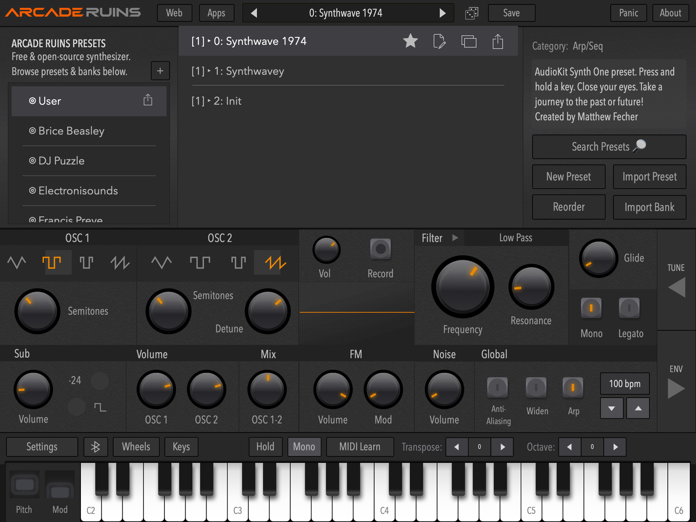

# Arcade Ruins

A polyphonic synthesizer for macOS — standalone app and AUv3 instrument plugin.

**Arcade Ruins is an unofficial macOS port of [AudioKit Synth One](https://github.com/AudioKit/AudioKitSynthOne),**
which was released for iOS and iPadOS under the MIT licence and archived in 2022. It is not
affiliated with, authorised by, or endorsed by AudioKit or AudioKit Pro, LLC. See
[NOTICE.md](NOTICE.md) for full attribution.

Synth One was a genuinely good instrument that stopped where iOS stopped. This project takes the
DSP, the interface and the sounds to the Mac, and makes them available inside a DAW.

---

## What it is

| | |
|---|---|
| **Standalone** | Mac Catalyst app |
| **Plugin** | AUv3 instrument — `aumu` / `ruin` / `BP03` |
| **Hosts** | Logic Pro, GarageBand, Live, Reaper, Bitwig |
| **Voices** | 6-voice polyphonic, or monophonic with glide |
| **Parameters** | 150, all host-automatable |
| **Presets** | 695 across 13 banks, offered to hosts as factory presets |
| **Requires** | macOS 11 or later, Apple silicon or Intel |

Two morphing band-limited oscillators plus a sub and FM, a resonant multi-mode filter, a 16-step
sequencer and arpeggiator, delay/reverb/chorus/phaser/bitcrush/autopan, and an unusually complete
**microtonal tuning system** — Scala import, arbitrary notes-per-octave, and Erv Wilson's
combination-product-set scales.

In a plugin, the arpeggiator and sequencer follow the host's tempo and transport.

## Status

Phase 4 of 5. The plugin loads, validates, renders, saves its state into a host session and
responds to automation; the standalone runs. See [STATE.md](STATE.md) for live status and
[PORT_PLAN.md](PORT_PLAN.md) for the task board.

This is a personal project, shared for testing. It is not on the App Store.

## Download and install

**One download holds both the standalone app and the plugin.** An AUv3 plugin lives inside its app;
there is no separate `.component` to install.

> **The first build is with Apple for notarisation and will appear under
> [Releases](https://github.com/badpackets303/ArcadeRuins/releases) shortly.** Until then, the source
> here builds and runs — see [Building](#building).

1. Download `ArcadeRuins-<version>-macOS.zip` from the
   [latest release](https://github.com/badpackets303/ArcadeRuins/releases/latest) and unzip it.
2. Move **ArcadeRuins.app** to your **Applications** folder. The plugin is only registered from there.
3. **Open it once.** That registers the plugin with macOS. The release is signed with a Developer ID
   and notarised by Apple, so it opens without a warning.
4. **Quit and reopen your DAW**, then look among its AU instruments for **BadPackets: Arcade Ruins**
   (in Logic Pro: AU Instruments → BadPackets → Arcade Ruins). A DAW that was already running does not
   see a newly installed plugin.

Presets, banks and favourites are shared between the app and the plugin, so a preset saved in one
appears in the other.

**Known limitations:** there is no app icon yet. The plugin has been tested in Logic Pro; other hosts
are untested. Please report problems, with your macOS version and host, in
[Issues](https://github.com/badpackets303/ArcadeRuins/issues).

## Screenshots

The standalone app:


The preset browser: 695 factory presets in 13 banks, plus your own.



The plugin in Logic Pro:


## Building

Requires Xcode 26 or later and [XcodeGen](https://github.com/yonaskolb/XcodeGen)
(`brew install xcodegen`).

```bash
Scripts/build.sh
```

`SynthOne.xcodeproj` is **generated** — edit [`project.yml`](project.yml) and re-run, or hand edits
will be lost.

Run the test suite:

```bash
xcodebuild -project SynthOne.xcodeproj -scheme SynthOne \
    -destination 'platform=macOS,variant=Mac Catalyst' -derivedDataPath ./DerivedData test
```

The suite includes golden renders of 20 shipped presets, so a change that alters the sound fails
immediately rather than at the end of a phase.

### Installing the plugin

macOS registers an AUv3 from the containing app, so the app has to live in `/Applications` — there
is no `.component` file to copy. This installs it and validates it:

```bash
Scripts/validate-au.sh
```

**Quit and relaunch your host afterwards.** A running host holds the previous build, and a stale
extension presents as silence rather than as an error.

## Layout

```
PORT_PLAN.md   Phases and task IDs, with acceptance criteria
STATE.md       Live status and session log
CLAUDE.md      Standing rules for the port
docs/          Architecture, the ADR log, the API surface, build notes
upstream/      AudioKitSynthOne @ 6466a37, read-only — fetched by Scripts/fetch-references.sh
project.yml    XcodeGen spec — the source of truth for targets and build settings
Sources/       Soundpipe · S1Support · SynthOneCore · SynthOne · SynthOneAU
Tests/ Scripts/
```

`docs/01-decisions.md` is the interesting one. Every non-obvious decision in the port is recorded
there as a numbered ADR, including the ones that were wrong first.

## How it differs from Synth One

- **macOS, not iOS.** Mac Catalyst, at the Mac idiom's native 100% rather than the 77% an iPad app
  gets by default.
- **An AUv3 plugin**, which upstream listed as a "major update we intend" and never shipped. The
  AU parameter tree, host tempo and transport, and session state are all new work — upstream's
  `startRamp` was an empty function, so no automation event ever reached the DSP.
- **No AudioKit dependency and no CocoaPods.** Everything is vendored source.
- **No Ableton Link, no Audiobus, no Inter-App Audio, no analytics, no push notifications, no
  mailing list.** The iOS service integrations are gone; nothing in this build phones home.
- **Rebranded.** All AudioKit wordmarks and logo artwork have been replaced. The *layout* of the
  interface is deliberately preserved — that is the point of the port.

## Licence

MIT — see [LICENSE](LICENSE).

Ported and derived code retains its original copyright and licences; see [NOTICE.md](NOTICE.md).
If you fork this in turn, please keep the factory preset **bank names** intact — they are how the
sound designers who made those 695 presets are credited.
