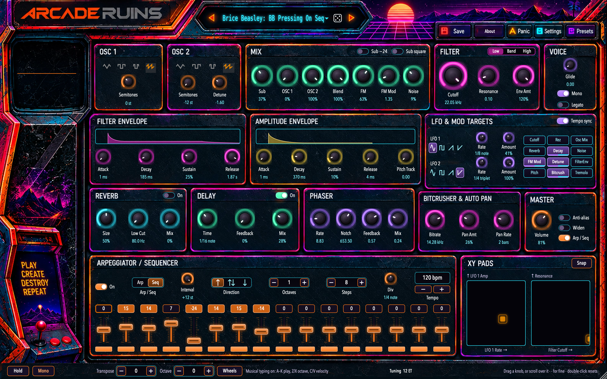
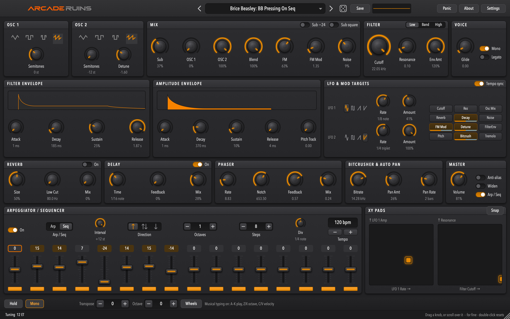
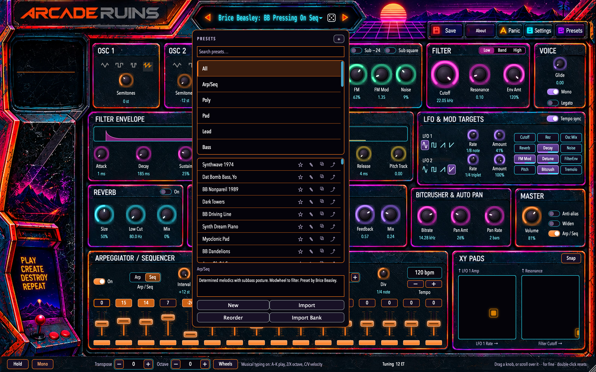
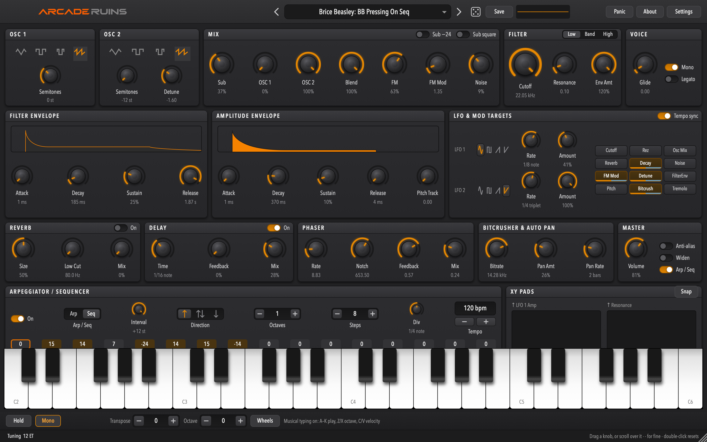
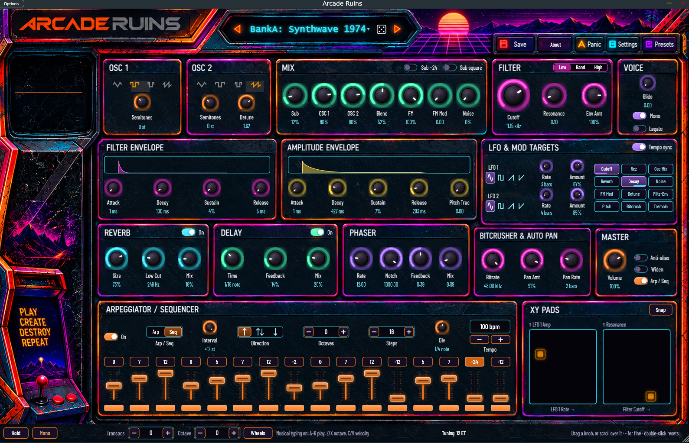
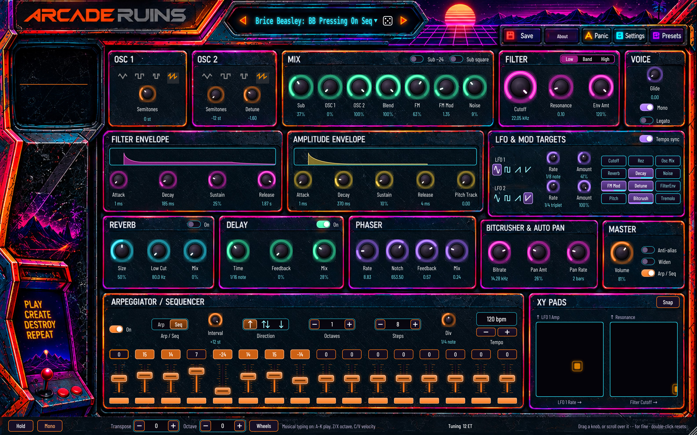
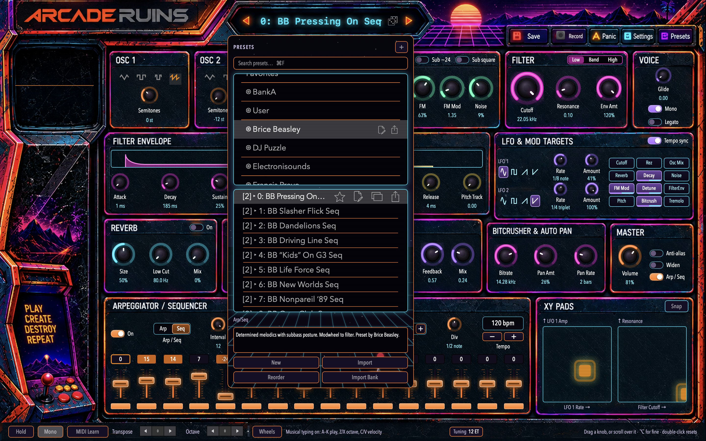

# Arcade Ruins

A polyphonic synthesizer — a plugin and a standalone instrument for **Windows, macOS and Linux**.

**Arcade Ruins is an unofficial port of [AudioKit Synth One](https://github.com/AudioKit/AudioKitSynthOne),**
which was released for iOS and iPadOS under the MIT licence and archived in 2022. It is not
affiliated with, authorised by, or endorsed by AudioKit or AudioKit Pro, LLC. See
[NOTICE.md](NOTICE.md) for full attribution.

Synth One was a genuinely good instrument that stopped where iOS stopped. This project takes the
DSP, the interface and the sounds to the desktop, and makes them available inside a DAW.



---

## Two products, one instrument

| | **Arcade Ruins** | **Arcade Ruins Classic** |
|---|---|---|
| **Runs on** | Windows 10+, macOS 11+, Linux (glibc 2.35+) | macOS 11+ |
| **Plugin** | VST3 everywhere · Audio Unit on macOS (`aumu` / `ArRu` / `BP03`) | AUv3 (`aumu` / `ruin` / `BP03`) |
| **Standalone** | yes, on all three | yes — a Mac Catalyst app |
| **Interface** | the desktop layout, in the Cabinet and Studio skins; the window scales 75–150% | **Synth One's own iPad interface**, and the desktop layout behind a switch |
| **Built with** | [JUCE](https://juce.com) 9 and CMake | UIKit (Mac Catalyst) and Xcode |
| **Where** | [`Sources/S1Plugin`](Sources/S1Plugin) | [`Sources/SynthOne`](Sources/SynthOne), [`Sources/SynthOneAU`](Sources/SynthOneAU), [`Sources/SynthOneCore`](Sources/SynthOneCore) |

They are the same instrument: **one engine** ([`Sources/S1Engine`](Sources/S1Engine), portable C++
with no Apple or JUCE code in it) is compiled into both, with the same 150 parameters and the same
695 factory presets, and twenty of those presets are rendered and compared in the tests of both —
bit for bit on Apple silicon. A preset bank exported from Classic opens in Arcade Ruins. On a Mac
the two install side by side, and a DAW lists them under their own names.

Classic exists because the iPad interface is worth keeping: twelve panels, Synth One's own knobs
and its on-screen keyboard, as its designers drew them.

## What it is

| | |
|---|---|
| **Voices** | 6-voice polyphonic, or monophonic with glide |
| **Parameters** | 150, all host-automatable |
| **Presets** | 695 across 13 banks, offered to hosts as factory presets |
| **Hosts** | any VST3 or Audio Unit host: Logic Pro, GarageBand, Live, Reaper, Bitwig, Cubase, FL Studio… |

Two morphing band-limited oscillators plus a sub and FM, a resonant multi-mode filter, a 16-step
sequencer and arpeggiator, delay/reverb/chorus/phaser/bitcrush/autopan, and an unusually complete
**microtonal tuning system** — Scala import, arbitrary notes-per-octave, and Erv Wilson's
combination-product-set scales.

In a plugin, the arpeggiator and sequencer follow the host's tempo and transport.

## Status

**Arcade Ruins 1.0.0** (cross-platform): released 2026-09-22 — validated with Steinberg's VST3
validator, pluginval at strictness 10, Apple's `auval`, and a RealtimeSanitizer build, on macOS,
Linux and Windows.
**Arcade Ruins Classic**: version 0.5.0 is released, below.

See [STATE.md](STATE.md) for live status, [PORT_PLAN.md](PORT_PLAN.md) for the task board and
[docs/release-notes.md](docs/release-notes.md) for what changed in each version.

This is a personal project, shared for testing. It is not on the App Store.

## Download and install

### Arcade Ruins 1.0.0 — Windows, macOS, Linux

| | |
|---|---|
| **macOS** 11+ | [⬇ ArcadeRuins-1.0.0-macOS.pkg](https://github.com/badpackets303/ArcadeRuins/releases/download/v1.0.0/ArcadeRuins-1.0.0-macOS.pkg) — the VST3, the Audio Unit and the standalone, each a choice. Signed and notarised; installs without a warning. Universal. |
| **Windows** 10+ | [⬇ ArcadeRuins-1.0.0-Windows-x64.exe](https://github.com/badpackets303/ArcadeRuins/releases/download/v1.0.0/ArcadeRuins-1.0.0-Windows-x64.exe) — the VST3 and the standalone. **Not signed**: see the note below. |
| **Linux** glibc 2.35+ | [⬇ x86-64](https://github.com/badpackets303/ArcadeRuins/releases/download/v1.0.0/ArcadeRuins-1.0.0-linux-x86_64.tar.gz) · [⬇ aarch64](https://github.com/badpackets303/ArcadeRuins/releases/download/v1.0.0/ArcadeRuins-1.0.0-linux-aarch64.tar.gz) — the VST3 and the standalone, with an `install.sh` that needs no root. |

Every one carries its SHA-256 on the [release page](https://github.com/badpackets303/ArcadeRuins/releases/tag/v1.0.0),
and every one leaves your presets alone when it is uninstalled. It also
[builds from source](#building) in a few minutes.

*Version 1.0.0 — its own number; Classic keeps the 0.x line. On an Intel Mac the build is signed
and universal but has not been tested on one.*

**On Windows the installer is not signed** (a certificate that would silence it costs several
hundred a year, which this project does not spend). Windows will show **"Windows protected your
PC"**, whose default button is *Don't run*: choose **More info → Run anyway**, and expect the
permission prompt to say *unknown publisher*. Check the published SHA-256 against your download if
you would rather be sure. The macOS package is signed and notarised and installs without any of
this.

### Arcade Ruins Classic — macOS

#### [⬇ Download Arcade Ruins Classic 0.5.0 for macOS](https://github.com/badpackets303/ArcadeRuins/releases/download/v0.5.0/ArcadeRuins-0.5.0-macOS.zip)

*(0.5.0 was released before the name "Classic": it appears as **Arcade Ruins** in the Dock and in
a DAW. The next release carries the new name; sessions keep working, because a host finds the
plugin by its code, which has not changed.)*

**That one download is both products** — the standalone app *and* the AUv3 plugin:

| | | |
|---|---|---|
| **Standalone app** | `ArcadeRuins.app` | Opens on its own. Drag it to Applications. |
| **AUv3 plugin** | `ArcadeRuins.app/Contents/PlugIns/ArcadeRuinsAU.appex` | **BadPackets: Arcade Ruins** in your DAW (`aumu` / `ruin` / `BP03`). |

An AUv3 plugin lives inside its app — that is how macOS ships them — so there is no separate
`.component` to install and nothing else to download. Installing the app installs the plugin.

Signed with Developer ID and notarised by Apple. macOS 11 or later; universal, Apple silicon and
Intel. Every version is on the [Releases](https://github.com/badpackets303/ArcadeRuins/releases) page.

1. Download and unzip
   [`ArcadeRuins-0.5.0-macOS.zip`](https://github.com/badpackets303/ArcadeRuins/releases/download/v0.5.0/ArcadeRuins-0.5.0-macOS.zip).
2. Move **ArcadeRuins.app** to your **Applications** folder. The plugin is only registered from there.
3. **Open it once.** That registers the plugin with macOS. It opens without a Gatekeeper warning.
4. **Quit and reopen your DAW**, then look among its AU instruments for **BadPackets: Arcade Ruins**
   (in Logic Pro: AU Instruments → BadPackets → Arcade Ruins). A DAW that was already running does not
   see a newly installed plugin.

Presets, banks and favourites are shared between the app and the plugin, so a preset saved in one
appears in the other.

**Known limitations:** the desktop layout needs a 1440×900 area, so it does not fit a 13-inch
display at its default scaling — the classic layout, which is the default, does not. The plugin
has been tested in Logic Pro; other hosts are untested. Please report problems, with your macOS version and host, in
[Issues](https://github.com/badpackets303/ArcadeRuins/issues).

## Screenshots

### Arcade Ruins

**Studio**, the plain skin — the same layout, and the same controls:



**The preset browser** drops down from the preset name — 695 factory presets in 13 banks plus your
own, with search, favourites, categories, notes and reordering:



**The keyboard drawer** (⌘K, or Ctrl+K) — hold, octave, the wheels, and musical typing on the
computer's keys:



**On Windows**, the standalone — captured from a real machine:



**On Linux**, drawn by the same code in Barlow Condensed (the typeface it carries for systems
without Avenir Next Condensed). *This and the macOS pictures above are rendered by the plugin's own
snapshot tool rather than captured from a DAW.*



### Arcade Ruins Classic

**The classic interface**, Synth One's own iPad layout, is what a fresh install opens with. Settings
▸ Layout switches to the desktop one, and back.


**The desktop layout.** One screen, no tabs, every section visible at once.


**The Cabinet skin**, over the same layout: a painted arcade cabinet as the window — the frames,
titles, header and toolbar buttons are artwork — with one neon colour per section, glowing
controls, and the scope running in the cabinet's screen.


**The preset browser** drops down from the preset name — 695 factory presets in 13 banks plus your
own, with search (⌘F), favourites, categories, notes and reordering. In Studio:


and in Cabinet, where the lists and the XY pads are framed as screens:



**Settings** picks the interface and the skin, in the app and in the plugin.


Classic in Logic Pro (this capture is from 0.1.0):


## The interface (Classic)

Arcade Ruins has the desktop layout below and both skins, with three differences: the skin changes
at once, the window scales, and the keyboard is a drawer rather than gone. It has no classic layout.

**Desktop layout** (Settings ▸ Layout ▸ Desktop). One screen, no tabs: oscillators, mix, filter and voice
across the top; the two envelopes and the LFOs; the effects and master; the arpeggiator/sequencer
with its sixteen steps at a usable height, and the XY pads. Every knob shows its value in real units
(Hz, ms, semitones, bars). Drag a knob or scroll over it; hold ⌥ for fine control; double-click
resets. The on-screen keyboard is gone — play from a MIDI controller or the computer keyboard
(A–K play, Z/X change octave, C/V change velocity; the play bar has hold, mono, MIDI learn,
transpose, octave and the wheels).

- **Preset browser.** Click the preset name in the toolbar, or ⌥⌘P, or View ▸ Preset Browser. It
  drops down over the panels; click anywhere else or press Escape to put it away. ⌘F searches.
- **Window.** Minimum 1440×900. Above that the sequencer row grows and the flexible sections
  spread.
- **Plugin.** The same layout, at 1440×900 in the host's plugin window. Editors and the tunings
  panel open as overlays inside it.

**Skins.** Settings (in the toolbar) ▸ Skin, or View ▸ Skin ▸ Studio | Cabinet, applied at the
next launch. Settings is also how the **plugin** chooses its layout and skin, since it has no menu
of its own. Cabinet is the default, and synthwave: the whole window is a painted
arcade cabinet, each section's controls lit in their own neon (orange, mint, pink, violet, gold,
cyan), the preset lists on a CRT. It is the one skin that places the sections — in the painting's
frames — and draws four of them a size smaller to fit; every control and shortcut is the same
under each. (Neon Ruins, the code-drawn skin of 0.3.0 and 0.4.0, was replaced by Cabinet; a
saved Neon Ruins choice opens Cabinet.) From a terminal:

```bash
defaults write com.badpackets303.ArcadeRuins S1Skin cabinet
```

**Classic layout.** Settings ▸ Layout ▸ Classic, or View ▸ Classic Layout, switches back to Synth One's iPad interface, scaled to the
window, at the next launch. The same switch from a terminal, for the app and the plugin:

```bash
defaults write com.badpackets303.ArcadeRuins S1ClassicLayout -bool YES
```

The two layouts share every control, binding and preset: nothing is lost by switching.

## Building

### Arcade Ruins (Windows, macOS, Linux)

CMake 3.22 or later and a C++17 compiler — Xcode's Clang, GCC 11+, or Visual Studio 2022+. JUCE is
fetched at a pinned commit when the build is configured; it is not in this repository. On Linux,
JUCE's usual packages (`libasound2-dev libfreetype6-dev libfontconfig1-dev libx11-dev
libxrandr-dev libxinerama-dev libxcursor-dev libxext-dev …` — [`Scripts/linux/Dockerfile.release`](Scripts/linux/Dockerfile.release)
is the exact list).

```bash
cmake -S . -B build/plugin -DS1_BUILD_PLUGIN=ON -DCMAKE_BUILD_TYPE=Release
cmake --build build/plugin --config Release --parallel
ctest --test-dir build/plugin -C Release        # the engine's tests, the golden renders, the plugin's
```

The products are under `build/plugin/Sources/S1Plugin/ArcadeRuins_artefacts/Release/` — `VST3/`,
`Standalone/`, and on macOS `AU/`. [`Sources/S1Plugin/README.md`](Sources/S1Plugin/README.md) is
the guide to that code; `Scripts/validate-plugin.sh`, `Scripts/validate-linux.sh` and
`Scripts\validate-windows.ps1` run the validators, and `Scripts/release-plugin.sh`,
`Scripts/release-linux.sh` and `Scripts\release-windows.ps1` build what is released.

### Arcade Ruins Classic (macOS)

Requires Xcode 26 or later and [XcodeGen](https://github.com/yonaskolb/XcodeGen)
(`brew install xcodegen`).

```bash
Scripts/build.sh
```

`SynthOne.xcodeproj` is **generated** — edit [`project.yml`](project.yml) and re-run, or hand edits
will be lost.

Run the test suite:

```bash
xcodebuild -project SynthOne.xcodeproj -scheme SynthOne \
    -destination 'platform=macOS,variant=Mac Catalyst' -derivedDataPath ./DerivedData test
```

Both suites include golden renders of 20 shipped presets, so a change that alters the sound fails
immediately rather than at the end of a phase.

### Installing Classic's plugin

macOS registers an AUv3 from the containing app, so the app has to live in `/Applications` — there
is no `.component` file to copy. This installs it and validates it:

```bash
Scripts/validate-au.sh
```

**Quit and relaunch your host afterwards.** A running host holds the previous build, and a stale
extension presents as silence rather than as an error.

## Layout

```
PORT_PLAN.md   Phases and task IDs, with acceptance criteria
STATE.md       Live status and session log
CLAUDE.md      Standing rules for the port
docs/          Architecture, the ADR log, the API surface, build notes
upstream/      AudioKitSynthOne @ 6466a37, read-only — fetched by Scripts/fetch-references.sh
project.yml    XcodeGen spec — Classic's targets and build settings
CMakeLists.txt The portable build — the engine and Arcade Ruins
Sources/       S1Engine (the portable engine, in both) · S1Plugin (Arcade Ruins, JUCE)
               Soundpipe · S1Support · SynthOneCore · SynthOne · SynthOneAU (Classic)
Tests/ Scripts/
```

`docs/01-decisions.md` is the interesting one. Every non-obvious decision in the port is recorded
there as a numbered ADR, including the ones that were wrong first.

## How it differs from Synth One

- **Windows, macOS and Linux, not iOS.** A VST3 everywhere, an Audio Unit on the Mac, a
  standalone on all three, from one portable engine.
- **Classic is Mac Catalyst,** at the Mac idiom's native 100% rather than the 77% an iPad app
  gets by default.
- **An AUv3 plugin**, which upstream listed as a "major update we intend" and never shipped. The
  AU parameter tree, host tempo and transport, and session state are all new work — upstream's
  `startRamp` was an empty function, so no automation event ever reached the DSP.
- **No AudioKit dependency and no CocoaPods.** Everything is vendored source.
- **No Ableton Link, no Audiobus, no Inter-App Audio, no analytics, no push notifications, no
  mailing list.** The iOS service integrations are gone; nothing in this build phones home.
- **Rebranded.** All AudioKit wordmarks and logo artwork have been replaced.
- **A desktop layout.** 0.1.0 preserved the iPad layout exactly. 0.2.0 re-homes the same controls
  into a layout for a Mac window — everything visible, a preset browser that drops down from the
  toolbar, no on-screen keyboard — and keeps the classic layout behind a switch. 0.3.0 adds skins; 0.4.0 the Cabinet skin; 0.5.0 makes it the synthwave skin.

## Licence

MIT — see [LICENSE](LICENSE).

Ported and derived code retains its original copyright and licences; see [NOTICE.md](NOTICE.md).
If you fork this in turn, please keep the factory preset **bank names** intact — they are how the
sound designers who made those 695 presets are credited.
