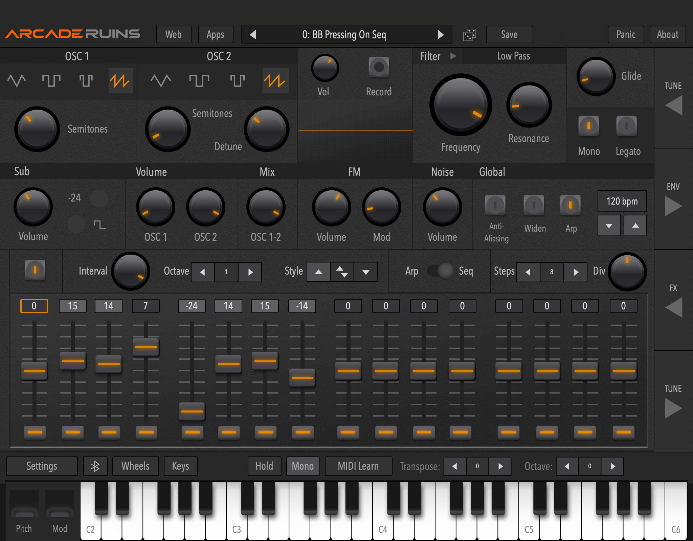
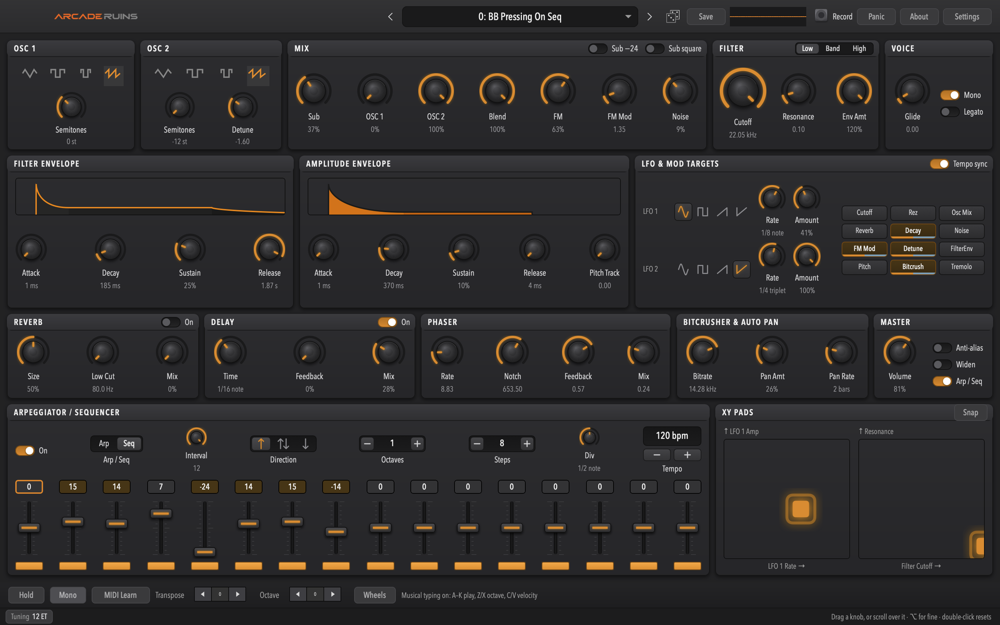
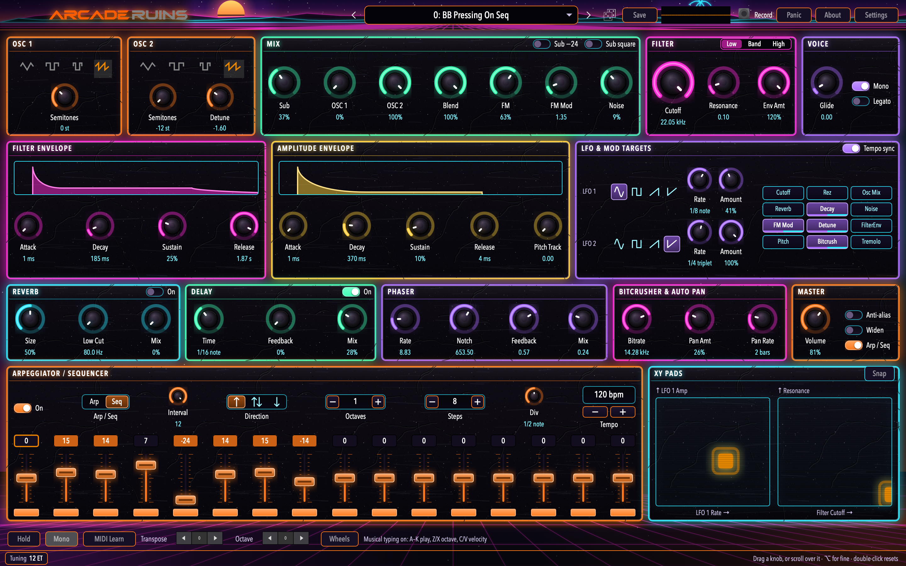
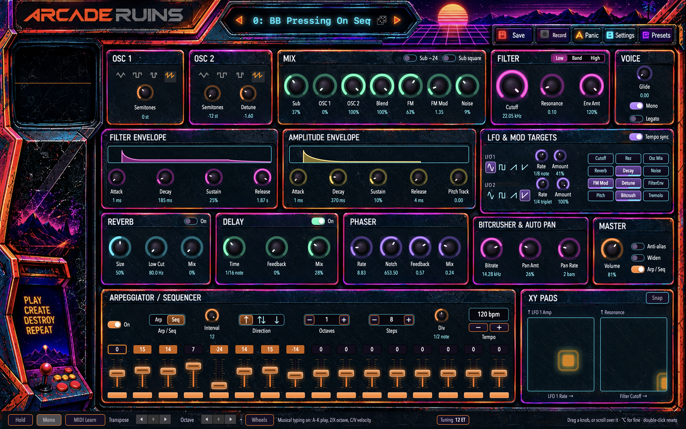
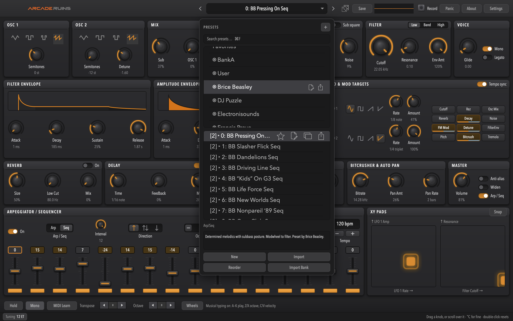
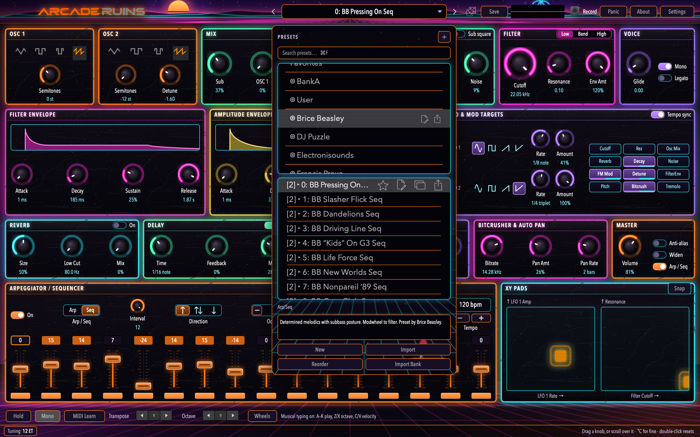
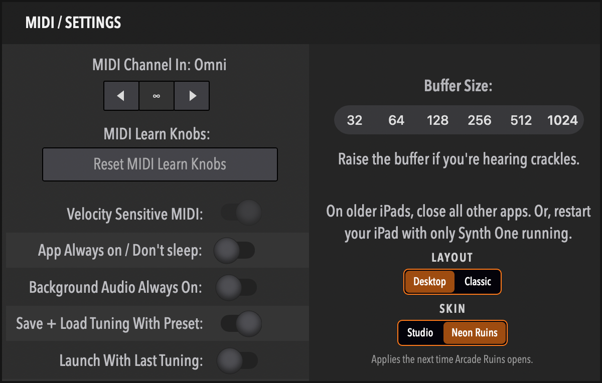
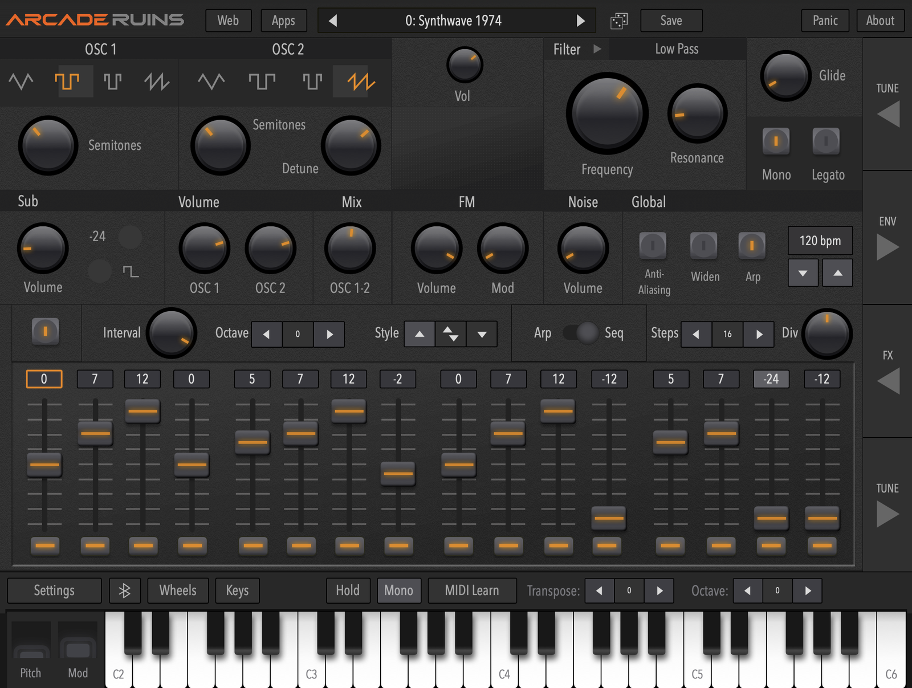

# Arcade Ruins

A polyphonic synthesizer for macOS — standalone app and AUv3 instrument plugin.

**Arcade Ruins is an unofficial macOS port of [AudioKit Synth One](https://github.com/AudioKit/AudioKitSynthOne),**
which was released for iOS and iPadOS under the MIT licence and archived in 2022. It is not
affiliated with, authorised by, or endorsed by AudioKit or AudioKit Pro, LLC. See
[NOTICE.md](NOTICE.md) for full attribution.

Synth One was a genuinely good instrument that stopped where iOS stopped. This project takes the
DSP, the interface and the sounds to the Mac, and makes them available inside a DAW.

---

## What it is

| | |
|---|---|
| **Standalone** | Mac Catalyst app |
| **Plugin** | AUv3 instrument — `aumu` / `ruin` / `BP03` |
| **Hosts** | Logic Pro, GarageBand, Live, Reaper, Bitwig |
| **Voices** | 6-voice polyphonic, or monophonic with glide |
| **Parameters** | 150, all host-automatable |
| **Presets** | 695 across 13 banks, offered to hosts as factory presets |
| **Requires** | macOS 11 or later, Apple silicon or Intel |

Two morphing band-limited oscillators plus a sub and FM, a resonant multi-mode filter, a 16-step
sequencer and arpeggiator, delay/reverb/chorus/phaser/bitcrush/autopan, and an unusually complete
**microtonal tuning system** — Scala import, arbitrary notes-per-octave, and Erv Wilson's
combination-product-set scales.

In a plugin, the arpeggiator and sequencer follow the host's tempo and transport.

## Status

Version 0.4.0. The plugin loads, validates, renders, saves its state into a host session and
responds to automation; the standalone runs; both have a layout designed for a Mac window rather
than an iPad screen. See [STATE.md](STATE.md) for live status, [PORT_PLAN.md](PORT_PLAN.md) for the
task board and [docs/release-notes.md](docs/release-notes.md) for what changed in each version.

This is a personal project, shared for testing. It is not on the App Store.

## Download and install

### [⬇ Download Arcade Ruins 0.4.0 for macOS](https://github.com/badpackets303/ArcadeRuins/releases/latest/download/ArcadeRuins-0.4.0-macOS.zip)

**That one download is both products** — the standalone app *and* the AUv3 plugin:

| | | |
|---|---|---|
| **Standalone app** | `ArcadeRuins.app` | Opens on its own. Drag it to Applications. |
| **AUv3 plugin** | `ArcadeRuins.app/Contents/PlugIns/ArcadeRuinsAU.appex` | **BadPackets: Arcade Ruins** in your DAW (`aumu` / `ruin` / `BP03`). |

An AUv3 plugin lives inside its app — that is how macOS ships them — so there is no separate
`.component` to install and nothing else to download. Installing the app installs the plugin.

Signed with Developer ID and notarised by Apple. macOS 11 or later; universal, Apple silicon and
Intel. Every version is on the [Releases](https://github.com/badpackets303/ArcadeRuins/releases) page.

1. Download and unzip
   [`ArcadeRuins-0.4.0-macOS.zip`](https://github.com/badpackets303/ArcadeRuins/releases/latest/download/ArcadeRuins-0.4.0-macOS.zip).
2. Move **ArcadeRuins.app** to your **Applications** folder. The plugin is only registered from there.
3. **Open it once.** That registers the plugin with macOS. It opens without a Gatekeeper warning.
4. **Quit and reopen your DAW**, then look among its AU instruments for **BadPackets: Arcade Ruins**
   (in Logic Pro: AU Instruments → BadPackets → Arcade Ruins). A DAW that was already running does not
   see a newly installed plugin.

Presets, banks and favourites are shared between the app and the plugin, so a preset saved in one
appears in the other.

**Known limitations:** the desktop layout needs a 1440×900 area, so it does not fit a 13-inch
display at its default scaling — the classic layout, which is the default, does not. The plugin
has been tested in Logic Pro; other hosts are untested. Please report problems, with your macOS version and host, in
[Issues](https://github.com/badpackets303/ArcadeRuins/issues).

## Screenshots

**The classic interface**, Synth One's own iPad layout, is what a fresh install opens with. Settings
▸ Layout switches to the desktop one, and back.



**The desktop layout.** One screen, no tabs, every section visible at once.



**The Neon Ruins skin**, over the same layout: one neon colour per section, drawn entirely in code.



**The Cabinet skin**: the same controls and colours over a painted arcade cabinet — the frames,
titles, header and toolbar buttons are artwork, and the scope runs in the cabinet's screen.



**The preset browser** drops down from the preset name — 695 factory presets in 13 banks plus your
own, with search (⌘F), favourites, categories, notes and reordering. In Studio:



and in Neon Ruins, where the lists and the XY pads are framed as screens:



**Settings** picks the interface and the skin, in the app and in the plugin.



The plugin in Logic Pro (this capture is from 0.1.0 and shows the classic layout):



## The interface

**Desktop layout** (Settings ▸ Layout ▸ Desktop). One screen, no tabs: oscillators, mix, filter and voice
across the top; the two envelopes and the LFOs; the effects and master; the arpeggiator/sequencer
with its sixteen steps at a usable height, and the XY pads. Every knob shows its value in real units
(Hz, ms, semitones, bars). Drag a knob or scroll over it; hold ⌥ for fine control; double-click
resets. The on-screen keyboard is gone — play from a MIDI controller or the computer keyboard
(A–K play, Z/X change octave, C/V change velocity; the play bar has hold, mono, MIDI learn,
transpose, octave and the wheels).

- **Preset browser.** Click the preset name in the toolbar, or ⌥⌘P, or View ▸ Preset Browser. It
  drops down over the panels; click anywhere else or press Escape to put it away. ⌘F searches.
- **Window.** Minimum 1440×900. Above that the sequencer row grows and the flexible sections
  spread.
- **Plugin.** The same layout, at 1440×900 in the host's plugin window. Editors and the tunings
  panel open as overlays inside it.

**Skins.** Settings (in the toolbar) ▸ Skin, or View ▸ Skin ▸ Studio | Neon Ruins | Cabinet, applied at the
next launch. Settings is also how the **plugin** chooses its layout and skin, since it has no menu
of its own. Studio is the dark-grey default; Neon Ruins is synthwave — one neon colour per section
(orange, mint, pink, violet, gold, cyan), hot borders over worn near-black panels, glowing
controls, a sunset and grid in the header, the preset lists on a CRT, and the wordmark lit. Cabinet (0.4.0) puts Neon Ruins' controls over a painted window: it is the one skin that
places the sections, in the painting's frames, and draws three of them a size smaller to fit. A skin changes only how things look: every control, size and shortcut is the same
under each. From a terminal:

```bash
defaults write com.badpackets303.ArcadeRuins S1Skin neonRuins
```

**Classic layout.** Settings ▸ Layout ▸ Classic, or View ▸ Classic Layout, switches back to Synth One's iPad interface, scaled to the
window, at the next launch. The same switch from a terminal, for the app and the plugin:

```bash
defaults write com.badpackets303.ArcadeRuins S1ClassicLayout -bool YES
```

The two layouts share every control, binding and preset: nothing is lost by switching.

## Building

Requires Xcode 26 or later and [XcodeGen](https://github.com/yonaskolb/XcodeGen)
(`brew install xcodegen`).

```bash
Scripts/build.sh
```

`SynthOne.xcodeproj` is **generated** — edit [`project.yml`](project.yml) and re-run, or hand edits
will be lost.

Run the test suite:

```bash
xcodebuild -project SynthOne.xcodeproj -scheme SynthOne \
    -destination 'platform=macOS,variant=Mac Catalyst' -derivedDataPath ./DerivedData test
```

The suite includes golden renders of 20 shipped presets, so a change that alters the sound fails
immediately rather than at the end of a phase.

### Installing the plugin

macOS registers an AUv3 from the containing app, so the app has to live in `/Applications` — there
is no `.component` file to copy. This installs it and validates it:

```bash
Scripts/validate-au.sh
```

**Quit and relaunch your host afterwards.** A running host holds the previous build, and a stale
extension presents as silence rather than as an error.

## Layout

```
PORT_PLAN.md   Phases and task IDs, with acceptance criteria
STATE.md       Live status and session log
CLAUDE.md      Standing rules for the port
docs/          Architecture, the ADR log, the API surface, build notes
upstream/      AudioKitSynthOne @ 6466a37, read-only — fetched by Scripts/fetch-references.sh
project.yml    XcodeGen spec — the source of truth for targets and build settings
Sources/       Soundpipe · S1Support · SynthOneCore · SynthOne · SynthOneAU
Tests/ Scripts/
```

`docs/01-decisions.md` is the interesting one. Every non-obvious decision in the port is recorded
there as a numbered ADR, including the ones that were wrong first.

## How it differs from Synth One

- **macOS, not iOS.** Mac Catalyst, at the Mac idiom's native 100% rather than the 77% an iPad app
  gets by default.
- **An AUv3 plugin**, which upstream listed as a "major update we intend" and never shipped. The
  AU parameter tree, host tempo and transport, and session state are all new work — upstream's
  `startRamp` was an empty function, so no automation event ever reached the DSP.
- **No AudioKit dependency and no CocoaPods.** Everything is vendored source.
- **No Ableton Link, no Audiobus, no Inter-App Audio, no analytics, no push notifications, no
  mailing list.** The iOS service integrations are gone; nothing in this build phones home.
- **Rebranded.** All AudioKit wordmarks and logo artwork have been replaced.
- **A desktop layout.** 0.1.0 preserved the iPad layout exactly. 0.2.0 re-homes the same controls
  into a layout for a Mac window — everything visible, a preset browser that drops down from the
  toolbar, no on-screen keyboard — and keeps the classic layout behind a switch. 0.3.0 adds skins; 0.4.0 adds the Cabinet skin.

## Licence

MIT — see [LICENSE](LICENSE).

Ported and derived code retains its original copyright and licences; see [NOTICE.md](NOTICE.md).
If you fork this in turn, please keep the factory preset **bank names** intact — they are how the
sound designers who made those 695 presets are credited.
